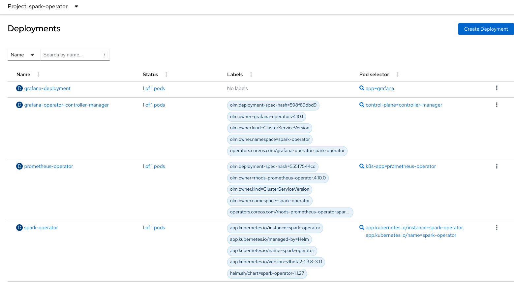

## Deploying Spark operator

Reference ReadMe which was followed: https://github.com/opendatahub-io-contrib/spark-on-openshift

Steps:

1. git clone https://github.com/opendatahub-io-contrib/spark-on-openshift
2. If you want a spark history server follow [this](https://github.com/opendatahub-io-contrib/spark-on-openshift#spark-history-server) section. You can use OpenShift Data Foundation in which case you will have to install[Link [1](https://access.redhat.com/documentation/en-us/red_hat_openshift_data_foundation/4.9/html/deploying_openshift_data_foundation_using_ibm_z_infrastructure/preparing_to_deploy_openshift_data_foundation), [2](https://access.redhat.com/documentation/en-us/red_hat_openshift_data_foundation/4.9/html/deploying_and_managing_openshift_data_foundation_using_red_hat_openstack_platform/deploying_openshift_data_foundation_on_red_hat_openstack_platform_in_internal_mode)] ODF first before creating the ObjectBucketClaim.
3. Next install the standalone spark operator. Following [this](https://github.com/opendatahub-io-contrib/spark-on-openshift/tree/main#working-with-the-spark-operator) section. Below is how the namespace spark-operator looks like:

